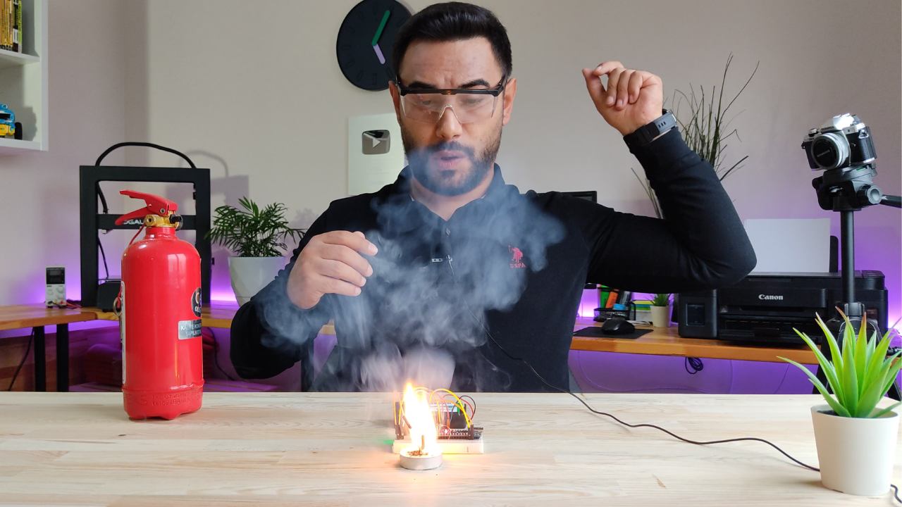

# Flame by Snapping Finger
Hi guys, we will make an interesting project in this video. We will try to make a flame by snapping our finger.    
     
# Video Tutorial
   
👉🏻 **Get the Gerber File & Circuit:**  
New members first order & Low Price for PCB Stencil at https://www.pcbway.com/    
👉🏻 **ATtiny Bootloader Shield:** https://youtu.be/PbrSABWPlBg   
  
👉🏻 **Parts Required for Prototype**: 
1x Arduino Nano V3 - http://bit.ly/2MHVDYi  
1x Sound Sensor Module - https://bit.ly/3fuZoP7  
1x IRFZ44N Mosfet - https://bit.ly/3fthnFF  
2x 3.7v Battery 18650 - https://bit.ly/2ECGb01  
1x Battery Holder 18650 - https://bit.ly/30cqwMJ  
1x Breadboard - http://bit.ly/30ckFoc  
Resistor Pack - http://bit.ly/2lJhi8Z  
Jumper Wires - http://bit.ly/2MtyZCX  
Matches and Candles  
